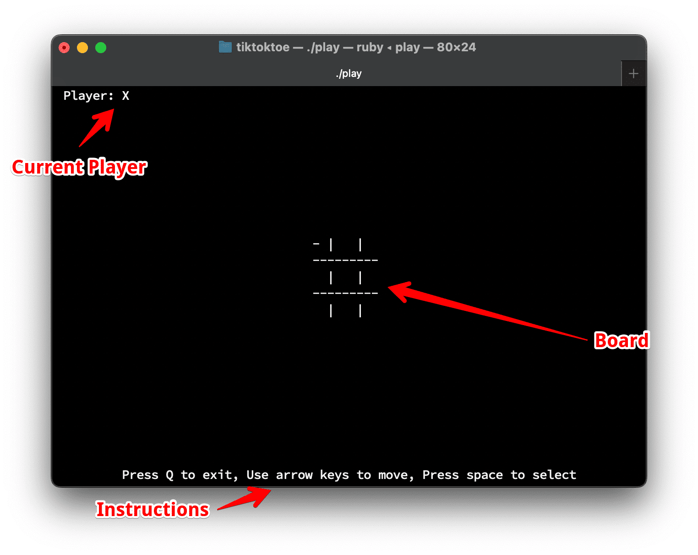

## Tic Tac Toe
A Tic Tac Toe game written in ruby.

## Features

* Two-player gameplay
* Keyboard navigation (arrow keys for movement, space to select)
* Easy-to-read console display

## Installation

Currently only dependency is curses. But first, Ensure you have Ruby installed on your system and clone this repository.

```sh
 gem install curses
```

Follow the instructions from https://github.com/ruby/curses if you find any dependency failures.

### How to play
Run the game using

```
./play
```

Use the arrow keys to move the cursor, space to mark X or O, and 'q' to quit the game.


### Screenshot



## Contributing

Contributions are welcome! Please feel free to submit pull requests, report bugs, and suggest features.

## License

This project is dedicated to the public domain under the Unlicense. This means it's free for personal and commercial use, modification, distribution, and so on, without any restrictions whatsoever. For more details, see the [LICENSE](LICENSE) file included in this repository.

